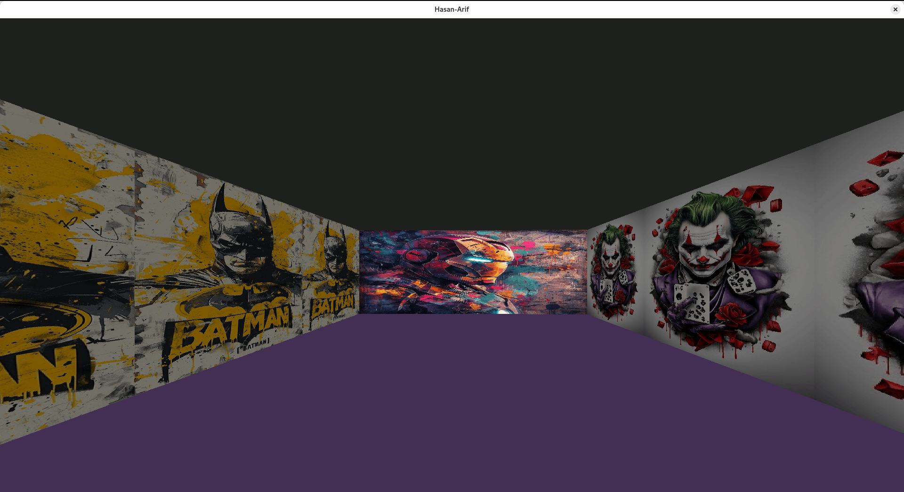
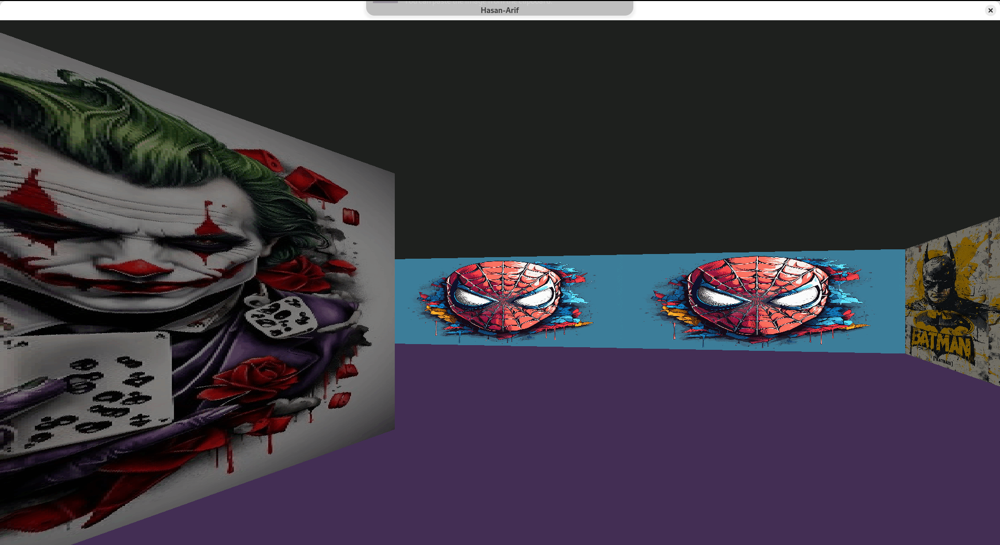

# cub3D - İlk RayCaster Projem - Linux

## Proje Hakkında
Bu proje, dünyaca ünlü ilk FPS oyunlarından biri olarak kabul edilen **Wolfenstein 3D**'den esinlenerek geliştirilmiş bir **RayCaster** projesidir. Temel amaç, bir labirent içinde dinamik bir "ilk şahıs" (first-person) bakış açısıyla gezinmeyi sağlamaktır.

Proje boyunca **miniLibX** kütüphanesi kullanılarak pencere yönetimi, renkler, olaylar ve şekil doldurma gibi grafik tasarım becerileri geliştirilmektedir.

---

## Özellikler

### ✅ Zorunlu Kısım
- **Ray-Casting Prensibi:** Labirentin "gerçekçi" bir 3D grafiksel temsilini oluşturmak için ray-casting prensipleri kullanılır.
- **miniLibX Kullanımı:** Grafiksel arayüz miniLibX ile oluşturulmuştur.
- **Pencere Yönetimi:** Pencere küçültme, büyütme gibi durumlarda düzgün performans sağlanır.
- **Duvar Dokuları:** Kuzey, Güney, Doğu ve Batı yönlerine özel dokular.
- **Zemin ve Tavan Renkleri:** Farklı RGB renkleri ile özelleştirilebilir.
- **Klavye Kontrolleri:**
  - `W`, `A`, `S`, `D`: Hareket
  - `←`, `→`: Yön değiştirme
  - `ESC`: Programdan çıkış
  - Pencereyi kapatma butonu: Temiz çıkış
- **Harita Dosyası (.cub):**
  - `0`: Boşluk
  - `1`: Duvar
  - `N`, `S`, `E`, `W`: Oyuncu başlangıç yönü ve pozisyonu
  - Harita duvarlarla tamamen çevrili olmalıdır.
  - Diğer öğeler harita içeriğinden önce gelebilir.
  - Öğeler boşlukla ayrılabilir.
  - Harita içeriği her zaman son kısımdadır.
- **Harita Dosyasındaki Öğeler:**
- NO ./path_to_the_north_texture
- SO ./path_to_the_south_texture
- WE ./path_to_the_west_texture
- EA ./path_to_the_east_texture
- F 220,100,0 # Zemin rengi
- C 225,30,0 # Tavan rengi

  ---
## Hata Kodları

| Hata Kodu | Tanım                        | Açıklama                                      |
|-----------|------------------------------|-----------------------------------------------|
| -1        | _CUB_ERROR                   | Genel cub3D hatası                             |
| -2        | _NOT_OPEN                    | Dosya açılamadı                               |
| -3        | _ARGUMAN_ERROR               | Argüman hatası                                |
| -4        | _XPM_SO_ERROR                | Güney yönü XPM dokusu hatası                  |
| -5        | _XPM_NO_ERROR                | Kuzey yönü XPM dokusu hatası                  |
| -6        | _XPM_EA_ERROR                | Doğu yönü XPM dokusu hatası                   |
| -7        | _XPM_WE_ERROR                | Batı yönü XPM dokusu hatası                   |
| -10       | _ENCIRCLING_WALLS_ERROR      | Harita çevresi duvarlarla kaplı değil         |
| -11       | _MALLOC_ERROR                | Bellek (malloc) ayırma hatası                 |
| -12       | _INVALIED_ELEMENT            | Geçersiz öğe hatası                           |
| -15       | _MLX_INIT_ERROR              | miniLibX başlatılamadı                        |
| -16       | _MLX_WINDOW_ERROR            | miniLibX pencere oluşturma hatası            |
| -17       | _MLX_SO_ERROR                | miniLibX güney dokusu yükleme hatası         |
| -18       | _MLX_NO_ERROR                | miniLibX kuzey dokusu yükleme hatası         |
| -19       | _MLX_WE_ERROR                | miniLibX batı dokusu yükleme hatası          |
| -20       | _MLX_EA_ERROR                | miniLibX doğu dokusu yükleme hatası          |
| -21       | _MLX_ADDR_ERROR              | miniLibX görüntü adresi hatası                |
| -22       | _MLX_MAIN_IMG_ERROR          | miniLibX ana görüntü oluşturma hatası        |

## 👨‍💻 Geliştiriciler

- **Arif Esat Güngör**  
  👤 Kullanıcı Adı: `agungor`

- **Hasan AsLan**  
  👤 Kullanıcı Adı: `haslan`

  
